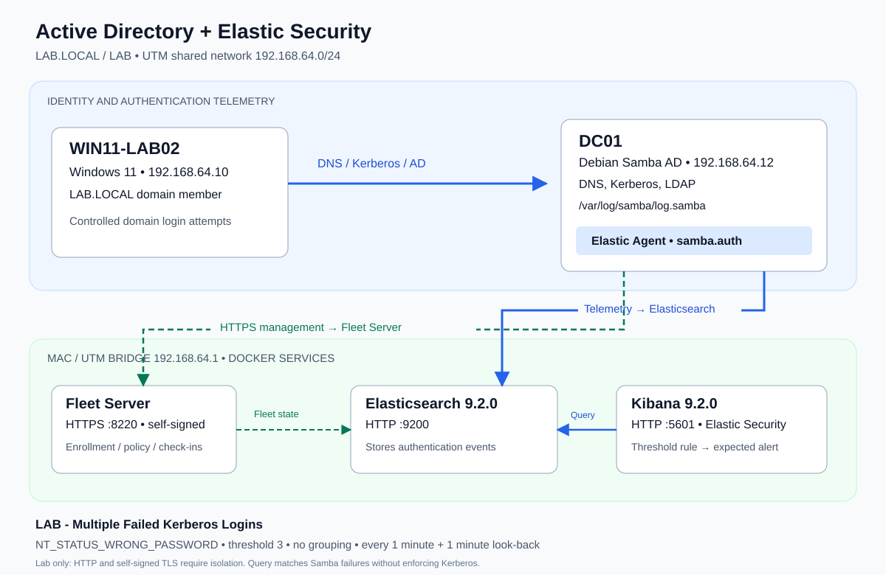

# Active Directory & Elastic Security Detection Lab

A hands-on identity and detection engineering project: a Windows 11 domain workstation authenticates against Samba Active Directory, while Elastic Security collects domain-controller logs and evaluates repeated authentication failures.

**Built by [Guwari](https://github.com/Guwari)** · Active Directory · Linux · Kerberos · Elastic Security · KQL · Docker

## What I built

- Provisioned `LAB.LOCAL` / `LAB` on Debian Samba AD domain controller `DC01`.
- Joined `WIN11-LAB02` to the domain and validated domain-user authentication.
- Deployed Elasticsearch **9.2.0** and Kibana **9.2.0** through Docker on an Apple Silicon Mac.
- Enrolled DC01 in Fleet and collected `/var/log/samba/log.samba` using Custom Logs (Filestream), dataset `samba.auth`.
- Investigated `NT_STATUS_WRONG_PASSWORD` events and created **LAB - Multiple Failed Kerberos Logins**, a threshold rule matching **3 events**.

This demonstrates identity administration, network troubleshooting, SIEM ingestion, telemetry validation, and detection design. The original lab walkthrough confirmed domain authentication, a Healthy agent, searchable Samba events, and rule creation. **A generated alert was not explicitly confirmed in the retained walkthrough**; the [validation guide](docs/09-testing-and-validation.md) explains how to capture that evidence.

## Architecture



| Component | Role | Address / endpoint |
|---|---|---|
| WIN11-LAB02 | Windows 11 domain workstation | `192.168.64.10` |
| DC01 | Debian Samba AD, DNS, Kerberos, LDAP, Elastic Agent | `192.168.64.12` |
| Mac / UTM bridge | Docker host and shared-network gateway | `192.168.64.1` |
| Fleet Server | Agent enrollment and policy management | `https://192.168.64.1:8220` |
| Elasticsearch 9.2.0 | Stores and searches telemetry | `http://192.168.64.1:9200` |
| Kibana 9.2.0 | Investigation and Elastic Security | `http://localhost:5601` |

**Data path:** Windows authentication → Samba audit log → DC01 Elastic Agent → Elasticsearch → Kibana / detection rule. Agent policy and enrollment use a separate HTTPS connection to Fleet Server. Fleet Server does not relay these log events.

## Detection at a glance

```kql
data_stream.dataset : "samba.auth" and
message : "NT_STATUS_WRONG_PASSWORD"
```

| Setting | Lab value |
|---|---|
| Name | LAB - Multiple Failed Kerberos Logins |
| Type | Threshold |
| Threshold | 3 matching events |
| Group by | None |
| Runs every | 1 minute |
| Additional look-back | 1 minute |

The rule counts failures across the dataset. Its name reflects the Kerberos test scenario; the query itself does **not** require a Kerberos field and can match other Samba password failures. It counts events, not necessarily three distinct human login attempts. See [scope, false positives, and investigation steps](detections/multiple-failed-kerberos-logins.md).

## Reproduce the lab

Start with the [lab overview](docs/01-lab-overview.md), then follow the numbered guides:

1. [Network architecture](docs/02-network-architecture.md)
2. [Samba Active Directory](docs/03-samba-active-directory.md)
3. [Windows domain join](docs/04-windows-domain-join.md)
4. [Elastic deployment](docs/05-elastic-security-deployment.md)
5. [Fleet and Elastic Agent](docs/06-fleet-and-elastic-agent.md)
6. [Log ingestion](docs/07-log-ingestion.md)
7. [Detection engineering](docs/08-detection-engineering.md)
8. [Testing and validation](docs/09-testing-and-validation.md)
9. [Troubleshooting](docs/10-troubleshooting.md)
10. [Lessons learned](docs/11-lessons-learned.md)

The config examples provide a rebuild baseline, not exported live configuration. Debian, Samba, Windows build and integration package versions were not recorded; note your versions when reproducing. Docker examples pin the recorded Elastic version.

## Repository layout

```text
.
├── README.md
├── SECURITY.md
├── .gitignore
├── .env.example
├── architecture/
│   ├── README.md
│   └── architecture-diagram.svg
├── configs/
│   ├── docker-compose.example.yml
│   ├── samba-audit.example.conf
│   └── elastic-agent.example.md
├── detections/
│   ├── README.md
│   └── multiple-failed-kerberos-logins.md
├── docs/                         # 01–11: build, validation, troubleshooting
└── screenshots/
    └── README.md                # Evidence checklist and redaction instructions
```

## Evidence and results

| Milestone | Retained lab evidence | Portfolio artifact |
|---|---|---|
| Domain join and domain login | Confirmed in project recap | Capture sanitized Windows domain settings |
| DC01 enrollment | User reported Healthy | Capture Fleet agent page |
| Samba ingestion and failures | User confirmed Discover results | Capture dataset, timestamp, and failure status |
| Custom threshold rule | User reported rule created | Capture definition and schedule |
| Generated alert | Not explicitly confirmed | Execute validation and capture alert details |

No screenshots or fabricated alerts are supplied. Follow [screenshot guidance](screenshots/README.md) to add authentic evidence.

## Security boundaries

**Educational lab only.** Elasticsearch uses HTTP and Fleet uses self-signed TLS in the recorded setup. HTTP exposes credentials and telemetry to network observers; lab `--insecure` enrollment skips Fleet certificate verification. Keep this network isolated, allow only the lab hosts, and never expose these ports to the internet.

All credentials, service tokens, enrollment tokens, and encryption keys are placeholders. Any secrets shared during setup must be rotated or revoked locally. See [SECURITY.md](SECURITY.md). Do not publish original terminal output or screenshots containing secrets.

## Next improvements

Parse Samba events into ECS fields; group failures by user and source; distinguish Kerberos from NTLM; add Windows/Sysmon telemetry; validate alert generation; use trusted TLS for every service; and export a tested detection rule after parsing and tuning.
